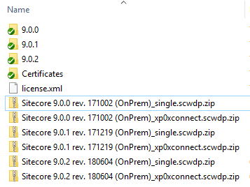

# Install Sitecore 9.0, 9.0.1, 9.0.2

As far as we know, from the first release of Sitecore 9 (Initial Release), it's used SIF (Sitecore Installation Framework) to install the new instance. However, the installation process now is not as simple as preceding version (Sitecore 8x). If the new instance of Sitecore 8x can be installed by SIM tool, we have to be familiar with PowerShell script to install the new instance of Sitecore 9.0 because SIF is implemented on PowerShell.

These script that will help us reduce the complexity of installing process. Now you can run only one command via **PowerShell Window** within your configuration values. It supports for the following Sitecore's version

- 9.0.0 - Initial Release
- 9.0.1 - Update 1
- 9.0.2 - Update 2

## Pre-Requisites

1. Sitecore 9 requires **Solr** and running on **SSL**. There are many way to install **Solr**, but my purpose is trying to experiment the newest technology which [Docker](https://www.docker.com/). Hence, it requires to install **Solr** via docker and also running in **SSL**. Please use another repository from mine to install [Solr-Docker]( https://github.com/kimcu-on-thenet/solr-docker)
2. Download one or 3 versions ([9.0 Initial Release](https://dev.sitecore.net/en/Downloads/Sitecore_Experience_Platform/90/Sitecore_Experience_Platform_90_Initial_Release.aspx), [9.0 update 1](https://dev.sitecore.net/en/Downloads/Sitecore_Experience_Platform/90/Sitecore_Experience_Platform_90_Update1.aspx), [9.0 update 2](https://dev.sitecore.net/en/Downloads/Sitecore_Experience_Platform/90/Sitecore_Experience_Platform_90_Update2.aspx))

## Getting Started

### Prepare to install

1. Clone the repository to your local (i.e `D:\github\sitecore-9-instance-manager`)
2. Extract the downloaded Sitecore packages, copy the following files to **`build\assets` ** folder in cloned repository folder
    1. Sitecore 9.0.0 rev. 171002 (OnPrem)_single.scwdp.zip
    2. Sitecore 9.0.0 rev. 171002 (OnPrem)_xp0xconnect.scwdp.zip
    3. Sitecore 9.0.1 rev. 171219 (OnPrem)_single.scwdp.zip
    4. Sitecore 9.0.1 rev. 171219 (OnPrem)_xp0xconnect.scwdp.zip
    5. Sitecore 9.0.2 rev. 180604 (OnPrem)_single.scwdp.zip
    6. Sitecore 9.0.2 rev. 180604 (OnPrem)_xp0xconnect.scwdp.zip
3. Copy your Sitecore license file (license.xml) to **`build\assets` **

**_After copied the above files, the `build\assets` look likes_**

### Install

1. Open the **PowerShell Window** as **Administrator**
2. Change the directory to cloned repository by the **`cd`** command
    `cd  D:\github\sitecore-9-instance-manager`
3. Execute the **`sc-install-xp0.ps1`** script with the following information

    - Install instance for Sitecore 9.0.0

    `.\sc-install-xp0.ps1 -scversion "9.0.0" -instanceName "habitat" -sqlServer "localhost" -sqlAdminUser "sa" -sqlAdminPassword "[your-sa-password]" -solrRoot "D:\\_solr" -scwebroot "D:\Inetpub\wwwroot"`
    - Install instance for Sitecore 9.0.1

    `.\sc-install-xp0.ps1 -scversion "9.0.1" -instanceName "habitat" -sqlServer "localhost" -sqlAdminUser "sa" -sqlAdminPassword "[your-sa-password]" -solrRoot "D:\\_solr" -scwebroot "D:\Inetpub\wwwroot"`
    - Install instance for Sitecore 9.0.2
    
    `.\sc-install-xp0.ps1 -scversion "9.0.2" -instanceName "habitat" -sqlServer "localhost" -sqlAdminUser "sa" -sqlAdminPassword "[your-sa-password]" -solrRoot "D:\\_solr" -scwebroot "D:\Inetpub\wwwroot"`

    **Notes:**

    - `scversion`: the Sitecore version that we want to install, for instance: **9.0.0, 9.0.1, 9.0.2** (please use exactly this format)
    - `instanceName`: the name of Sitecore's instance that we want to have (i.e. habitat)
    - `sqlServer`: _(optional)_ Default is **localhost**
    - `sqlAdminUser`: _(optional)_ Default is **sa**
    - `sqlAdminPassword`: the password of **sqlAdminUser**
    - `solrRoot`: the path of Solr instance (i.e `D:\\_solr`)
    - `scwebroot`: the path of IIS's wwwroot (i.e. `D:\Inetpub\wwwroot`)

4. Finally, let verify the instance on the browser

## Uninstall the specific Sitecore's instance

To uninstall completely the specific Sitecore's instance, just simply use the `sc-uninstall-xp0.ps1` script with the following script

`.\sc-uninstall-xp0.ps1 -scversion "9.0.1" -instanceName "habitat" -sqlServer "localhost" -sqlAdminUser "sa" -sqlAdminPassword "[your-sa-password]" -scwebroot "D:\Inetpub\wwwroot"`

## Additional Information

- This repository was inspired by [Habitat](https://github.com/Sitecore/Habitat)